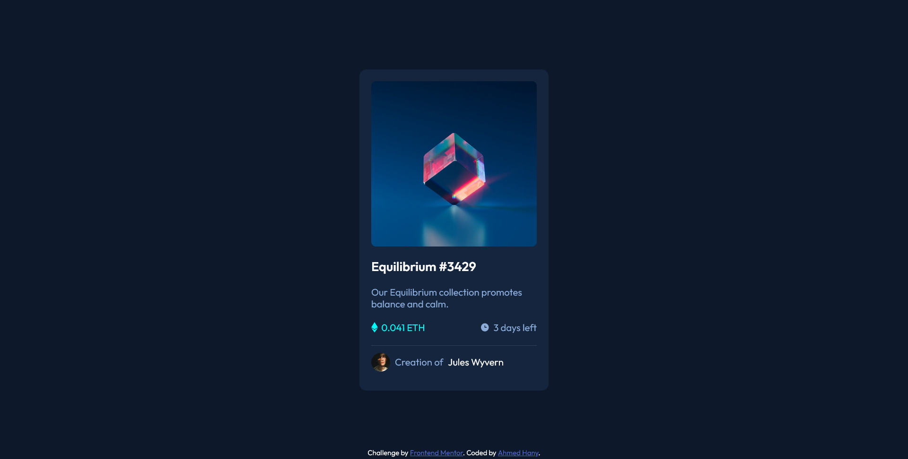

# Frontend Mentor - NFT preview card component solution

This is a solution to the [NFT preview card component challenge on Frontend Mentor](https://www.frontendmentor.io/challenges/nft-preview-card-component-SbdUL_w0U). Frontend Mentor challenges help you improve your coding skills by building realistic projects.

## Table of contents

- [Overview](#overview)
  - [Screenshot](#screenshot)
  - [Links](#links)
- [My process](#my-process)
  - [Built with](#built-with)
  - [What I learned](#what-i-learned)
  - [Useful resources](#useful-resources)
- [Author](#author)
- [Acknowledgments](#acknowledgments)

## Overview

### Screenshot



### Links

- [Source code](https://github.com/ahmedhanyh/nft-preview-card-component)
- [Live site URL](https://ahmedhanyh.github.io/nft-preview-card-component/)

## My process

### Built with

- Semantic HTML5 markup
- CSS custom properties
- CSS
  - CSS Flexbox

### What I learned

The part I struggled with a bit was making the active/hover state for the image. The first thing I've tried was to nest the image in a container like this:

```html
<div class="main__image-container">
  
</div>
```

then I've set the background image for the conatiner to be the view icon and modified its properties so that it becomes centered as in this CSS:

```css
.image-container {
  background-color: var(--cyan);
  background-image: url(./images/icon-view.svg);
  background-position: center;
  background-repeat: no-repeat;
  border-radius: 8px;
}
```

so now the original image is on top of the view icon.

Now, the only thing left would be to make the original image semi-transparent when it's hovered over:

```css
.image-container__main-image:hover {
  opacity: 0.5;
  cursor: pointer;
}
```

but that didn't work :disappointed: the view icon itself was also semi-transparent and that doesn't match the given design (it should be opaque).

I have to somehow make the view icon opaque and the background-color semi-transparent. We can change the background-color opacity alone using something like hsla() or rgba() css functions that specify, not only the color, but also the opacity/transparency for that color. But the issue is still not fixed though, the background-color just became more transparent. To get around this issue, I thought I'll put the view icon on top of the original image instead of the opposite. To achieve this I created another element and moved the background properties from the image container to that element, and used some positioning properties to put the view icon on top of the original image using this CSS:

```css
.main__image-container {
  position: relative;
}

.image-container__view-icon {
  background-color: hsla(178, 100%, 50%, 50%);
  background-image: url(./images/icon-view.svg);
  background-position: center;
  background-repeat: no-repeat;
  border-radius: 8px;
  position: absolute;
  top: 0px;
  width: 100%;
  height: 100%;
  opacity: 0;
}
```

and when we hover over the image (or actually the view icon since now it's the one on the top):

```css
.image-container__view-icon:hover {
  opacity: 1;
  cursor: pointer;
}
```

Now it produces the desired result.

Other notes:

- I could've made more use of flexbox to layout the card components but I've used margins and the natural flow of the document instead.

- I've used the [BEM naming methodology](https://getbem.com/naming/) to name classes.

### Useful resources

- [The Odin Project's Flexbox section](https://www.theodinproject.com/paths/foundations/courses/foundations#flexbox) - This part of the odin project explains flexbox in great detail. It also points you to great articles and to the MDN docs. This resource is enough to get familiar with flexbox.

## Author

- GitHub - [ahmedhanyh](https://github.com/ahmedhanyh)
- Frontend Mentor - [@ahmedhanyh](https://www.frontendmentor.io/profile/ahmedhanyh)

## Acknowledgments

I learned about the BEM naming methodology from [@FancyBaguette](https://www.frontendmentor.io/profile/FancyBaguette)'s [feedback](https://www.frontendmentor.io/solutions/interactive-rating-component-rqPfUOlrWu#:~:text=Most%20commonly%20used%20methodology%20is%20BEM%20%2D%20you%20can%20read%20about%20it%20here%20https%3A//getbem.com/naming/) to [@aheduardo5
](https://www.frontendmentor.io/profile/aheduardo5).
